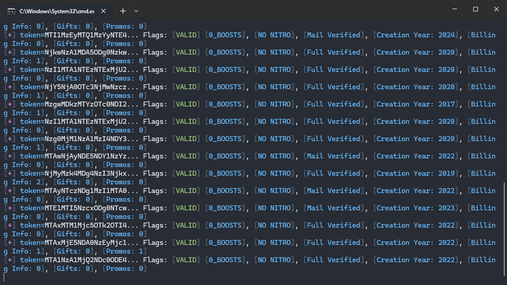

# Discord Token Checker

This script is designed to check discord tokens, gather information about the account associated with each token, and save the results to files. The script can use proxies for requests to avoid rate limiting.

## Features

- Checks the validity of Discord tokens.
- Retrieves account information, including verification status, creation year, nitro status, and boosts.
- Checks for billing information associated with the account.
- Retrieves gift codes and promotion codes associated with the account.
- Supports the use of proxies.
- You can change the checks.

## Requirements

- Python 3.x
- Requests library
- Colorama library

## Installation

1. Clone the repository:

```bash
git clone https://github.com/antipaster/Discord-Token-Checker.git
cd Discord-Token-Checker
```

2. Install the required libraries:

```bash
pip install requests colorama
```

3. Add your tokens to `tokens.txt` and your proxies to `proxies.txt` (if using proxies).

## Usage

1. Run the script:

```bash
python main.py
```

2. The script will ask if you want to use proxies. Type `yes` or `no`.

3. The script will check each token and save the results to `results.txt`. Gift codes will be saved to `gifts.txt`, and promo codes will be saved to `promos.txt`.

## Files

- `tokens.txt`: List of Discord tokens to be checked.
- `proxies.txt`: List of proxies to be used (optional).
- `results.txt`: Results of the token checks.
- `gifts.txt`: Retrieved gift codes.
- `promos.txt`: Retrieved promo codes.

## Example Output

```
Valid Tokens: 5 | Invalid Tokens: 3 | Nitro: 2 | Unclaimed: 1 | Mail Verified: 4 | Phone Verified: 2 | Full Verified: 1 | Billing Info: 3
```

## Proxy Format

Proxies should be listed in `proxies.txt` in the following format:

```
username:password@host:port
```


## Contributing

Contributions are welcome! Please open an issue or submit a pull request for any changes or improvements.

## Disclaimer

This script is for educational purposes only. The use of this script to access or use accounts without authorization is illegal and unethical.


